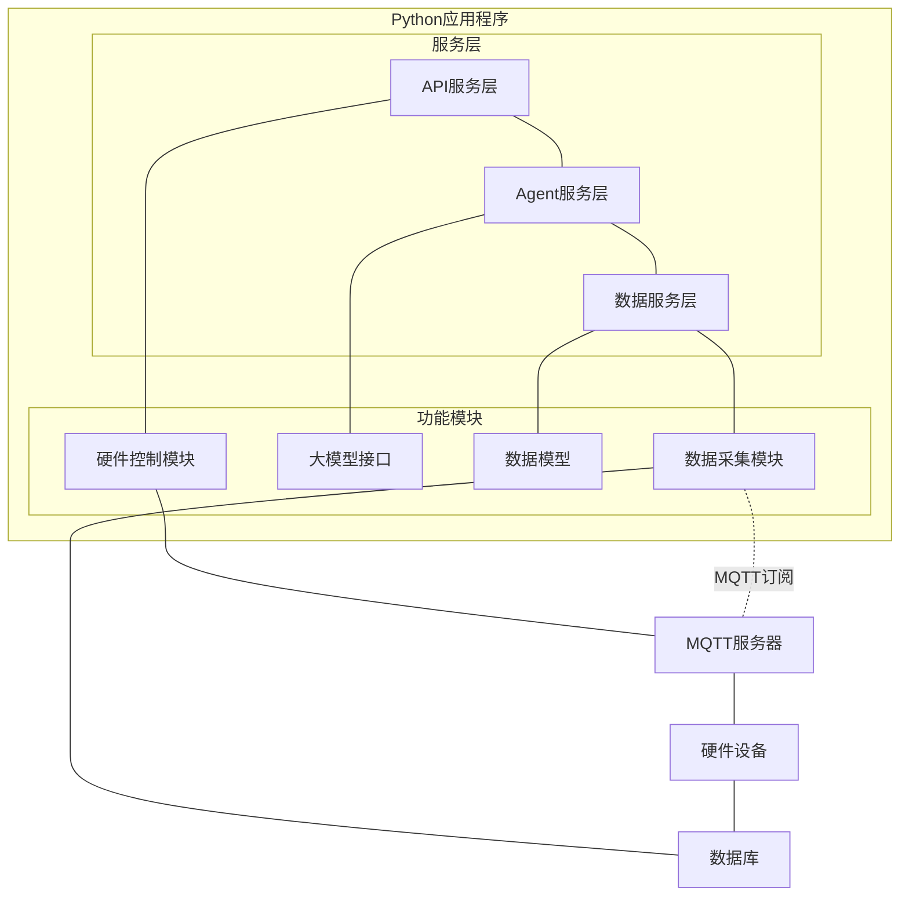

# 整体框架文档

小程序端：
用户提问，最近10天空气温湿度如何(小程序需要和后端建立websocket)

后端模块：
把提问请求发送给Agent端模块

Agent端模块：
把用户的提问请求一次大模型API，让大模型选择工具调用。

Agent端模块：
选择工具调用，注意接口传参，例如获取空气温湿度，使用后端的接口即可。

后端模块：
查询数据库，返回给Agent端模块。

agent端模块：
拿到后端返回数据后再次请求大模型厂商API获取回复。需要使用流式输出（SSE链接）

后端模块：
流式传输到小程序端渲染回复内容


# 系统架构设计

## 整体架构

采用分层设计，所有模块在一个Python程序中实现，通过接口调用实现模块间通信：



## 模块职责

### 1. API服务层
- 负责与小程序的WebSocket通信
- 接收用户请求并转发给Agent服务层
- 将Agent服务层的流式响应传回小程序
- 管理会话和连接状态
- 接收用户硬件控制指令并转发给硬件控制模块

### 2. Agent服务层
- 封装大模型API调用逻辑
- 实现工具选择和调用功能
- 通过接口调用数据服务层获取所需数据
- 处理流式输出，并通过回调传给API服务层
- 可根据分析结果向API服务层建议硬件控制操作

### 3. 数据服务层
- 封装数据库操作
- 提供数据查询和处理接口
- 实现数据缓存和优化策略
- 返回格式化的数据给Agent服务层
- 管理所有模块对数据库的访问

### 4. 数据采集模块
- 通过MQTT协议订阅传感器数据主题
- 实时接收各类传感器数据（温度、湿度、光照等）
- 对接收的数据进行初步处理和验证
- 将处理后的数据通过数据服务层接口存储到数据库
- 支持多种传感器数据格式解析

### 5. 硬件控制模块
- 提供硬件控制接口供API服务层调用
- 接收来自小程序的用户控制指令
- 支持基于阈值的自动控制规则设置
- 通过MQTT协议发布控制指令到相应主题
- 支持灌溉系统、温室环境控制等多种设备控制
- 实现控制指令的定时和条件触发
- 提供设备状态反馈和监控机制

## 模块间接口设计

### API服务层 → Agent服务层接口
```python
def process_query(query: str, session_id: str, callback) -> None:
    """
    处理用户查询
    
    参数:
        query: 用户查询内容
        session_id: 会话ID
        callback: 回调函数，用于接收流式响应
    """
```

### Agent服务层 → 数据服务层接口
```python
def get_temperature_humidity(days: int = 10) -> List[Dict]:
    """
    获取指定天数的温湿度数据
    
    参数:
        days: 查询的天数
    返回:
        温湿度数据列表
    """
```

### 数据采集模块 → 数据服务层接口
```python
def save_sensor_data(sensor_data: Dict) -> bool:
    """
    保存传感器数据
    
    参数:
        sensor_data: 传感器数据字典，包含传感器ID、类型、数值和时间戳等
    返回:
        保存成功返回True，否则返回False
    """
```

### API服务层 → 硬件控制模块接口
```python
def control_device(device_id: str, action: str, parameters: Dict = None) -> Dict:
    """
    控制设备执行特定动作
    
    参数:
        device_id: 设备ID
        action: 操作类型，如"开启灌溉"、"调节温度"等
        parameters: 操作参数，如持续时间、目标值等
    返回:
        操作结果和状态信息
    """
```